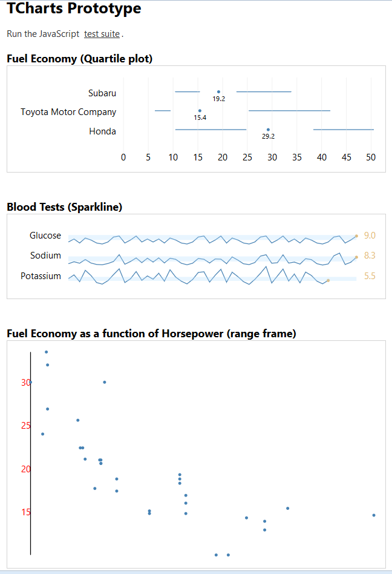

# Graphical Practice

Trying to build beautiful javascript charts that conform to the principles and sketches in 
[The Visual Display of Quantitative Information](http://www.edwardtufte.com/tufte/books_vdqi) by Edward Tufte.
 
 (Also, just practicing with d3.js)

 Here is a screenshot of the charts in action (the third chart, a range frame, is still a work in progress):

